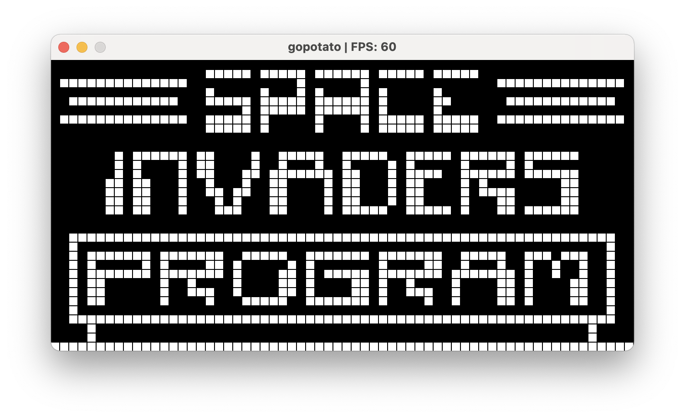

# gopotato
A CHIP-8 interpreter/emulator written in golang

## References:
- [Cowgod's Technical Reference](http://devernay.free.fr/hacks/chip8/C8TECH10.HTM)
- [wikipedia page](https://en.wikipedia.org/wiki/CHIP-8)
- [timing reference](https://jackson-s.me/2019/07/13/Chip-8-Instruction-Scheduling-and-Frequency.html)
